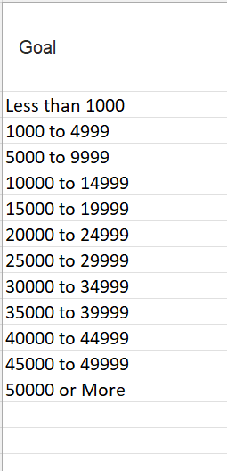
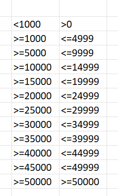
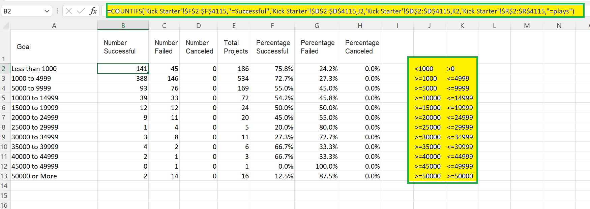
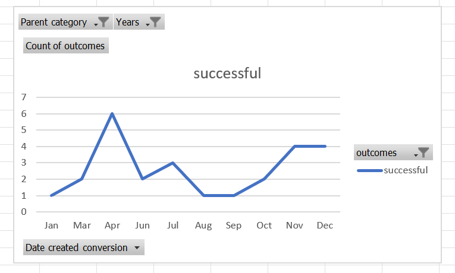

# Kickstarting with Excel

## Overview of Project
In this project, we worked on Crowdfunding data to determine the specific factors that contribute towards the success
of a campaign. We have used Pivot Table Analysis, extracted and created useful columns from existing dataset and
applied various Excel formulae in order to perform the desired analysis.

### Purpose
The main purpose of the project was to organize, sort and analyze the data, to uncover the hidden trends from raw
data using Excel. These trends can be helpful to retrieve useful insights and provide a greater understanding of
the data.

## Analysis and Challenges

### Analysis of Outcomes Based on Launch Date
The main purpose of analyzing outcomes based on launch date was to find out the best time of the year to
start a similar campaign, which has a greater success rate in comparison with other months. Based on the
count of the successful outcomes, campaigns under **theater** parent category were found to be most successful.
Following steps were followed for the analysis of theater outcomes based on launch date:

**1.** A **Years** column was created based on the **Date Created Conversion** column in the Kickstarter spreadsheet.

 

Above formula was used to compute the **Years** column from the **Date Created Conversion** column in the Kickstarter spreadsheet.

In the above image, it can be seen that the **Date Created Conversion** column is of the form "mm/dd/yyyy".
The years formula was used to extract the "yyyy" portion from the column.
We will later use this **years** column as a filter in our pivot table analysis.

**2.** Now the pivot table was created using the Kickstarter spreadsheet using the following parameters: 

- Filters: "Parent category" and "Years"
- Columns: "outcomes"\
Since we wanted to analyze the different kind of outcomes, we used "outcomes" as "Columns"
- Rows: "Date created conversion"\
Since data needs to be analyzed for different dates, so we selected "Date created conversion" in Rows area.
After dragging the "Date created conversion" field in the Row area, two other fields get auto-populated namely
"Years2" and "Quarters" along with "Date created conversion" field. Excel automatically populates these fields,
from which we can select the suitable field as per our requirements. In the current case, we chose
"Date created conversion" field so as to group the outcomes month-wise and removed the unwanted fields.
- Values: "Count of outcomes"\
Since we wanted to analyze the total number of "successful", "failed" and "canceled" outcomes, that's
why we have used the count measure.

**3.** Now we filtered "theater" from the parent category list since campaigns under the "theater" parent category
had the highest success rate based on the total number of outcomes.

**4.** Now the campaign outcomes were sorted in descending order using the sort option from data menu.

**5.** Now a line chart is created using the line chart option from insert menu to show the number of successful,
failed, or canceled projects by month.

### Analysis of Outcomes Based on Goals
The main purpose of the analysis was to visualize the percentage of "successful", "failed", and "canceled" plays based on
the funding goal amounts. This analysis can prove useful if we want to determine an optimum range of funding goal amount
that should be targeted in a similar campaign.\
Following steps were followed for the analysis of outcomes based on goals:

**1.** Firstly, the funding goal-amount ranges were created to group the projects based on their targeted goal amounts.

**2.** Now COUNTIFS() functions were used to populate "Number Successful", "Number Failed", and "Number Canceled" columns for "Plays" subcategory. 
The COUNTIFS function was applied in the following manner:/

- criteria_range_1: outcome column (F) range of Kickstarter spreadsheet was selected as criteria range_1 and,
- criteria_1: the outcome was compared against "successful" to get the number of successful campaigns.
- criteria_range_2: goal column (D) of Kickstarter spreadsheet was selected and,
- criteria_2: the goal amount was compared against the range of Funding goal amount according to column A
of "Outcomes based on Goals" spreadsheet.
- criteria_range_3: subcategory column (R) of Kickstarter spreadsheet was selected and,
- criteria_3: the subcategory was compared against "Plays" to filter the outcomes based on "Plays".

    

**3.** Now Sum() functions were used to populate the total number of projects under "Plays" subcategory that
were one of "successful", "failed" or "canceled".

**4.** Now we easily calculated the percentage of "successful", "failed" or "canceled" projects by dividing
the corresponding number by the total for each range of funding goal amounts. Values need to be round up by
four decimal points, so the ROUND() function was applied to the division result. We also had to use percentage
formatting for each of the newly calculated percentage columns.

**5.** Created a line chart titled "Outcomes Based on Goal" using line chart option from insert menu to
visualize the relationship between the funding goal-amount ranges on the x-axis and the percentage of "successful",
"failed", or "canceled" projects on the y-axis.

### Challenges and Difficulties Encountered

I found it difficult to apply the COUNTIFS() function to populate the number of "successful","failed" and "canceled"
outcomes in the "Outcomes based on Goals" spreadsheet. The COUNTIFS() function was required to be applied for each cell
according to the range of funding goal amount specified in column A of "Outcomes based on Goals" spreadsheet.
Technically, I could have edited and applied the function on each cell as per the applicable range, but it was too
repetitive and tedious to say the least. To avoid this repetition, I specified the range criteria in adjacent cells
for all rows, that could be referenced in the COUNTIFS() function.

Above image describes the mechanism I used to specify range in adjacent cells so that I could reference the same in
my COUNTIFS() function. This allowed me to just copy and paste the function (CTRL + D) in all rows corresponding to
each outcome.

Above image explains how the above created range was referenced in the function to avoid repeated modification.

## Results

- What are two conclusions you can draw about the Outcomes based on Launch Date?
    1. It is evident from the line chart that the number of "successful" outcomes peak in the month of May and
    gradually recede through the end of the year. This tells us that the month of May seems to be good month
    to launch a similar campaign and it has higher chances to succeed. Also, if we clear the parent category
    filter, we can see that the number of "successful" outcomes for overall campaigns also follow the same trend
    with a peak in the month of May.
    
    2. However, we observed that the given data does not exhibit similar trends over the years, so we have to
    take the current trends with a pinch of salt. We observed that the total number of campaigns under theater
    parent-category between 2009-2013 were only **26** and all were **successful** campaigns which is just **1.8%**
    of the overall campaign data under the theater parent-category. So essentially, the trends only reflect the
    trends for year 2014-2017.

- What can you conclude about the Outcomes based on Goals?

    It is evident from the line chart that as the funding goal amount increased for a campaign, the success rate for
    the campaigns has gradually dipped whereas the failure rate has gradually increased. This provides us an indication
    that a certain lower funding goal amount range seems to be contributing to success of a campaign. From the given data,
    it is evident that campaigns with funding goal-amounts less than **5000** are bound to be more successful.
    We also observed that there have been no cancellations of campaigns
    under "Plays" sub-category.
    
    However, we have been comparing the funding-goal amount values against each other without considering
    their currencies in a single line chart. I think this creates improper projection of the data. Moreover, if
    we just compare the goal amount values without considering their currencies, the trends can be biased.
    Ideally, we should be comparing apples with apples and this seems to be a comparison between apples and oranges! 

- What are some limitations of this dataset?

    With reference to "Theater outcomes by launch date", we observed that there is lack of data to analyze the trends
    between 2009 to 2017 for "theater" parent-category. Bulk of the data is ranging between the year 2014 to 2017,
    so either we do not have sufficient data for years 2009 to 2013 or we need more data to explain the lack of it.

    

    Above line chart shows the trends of counts of "successful","failed" and "canceled" campaigns between 2009 to 2013.
    As we can see there is no data for "failed" and "canceled". Furthermore, the data available for "successful" outcomes
    is also very less in comparison with other years.

- What are some other possible tables and/or graphs that we could create?
    1. We can analyze the counts of "successful", "failed" and "canceled" campaigns with respect to various range of duration.
    This can be achieved by creating another column of duration using the launch and end date data.

    2. We can also do a country-wise analysis to compare the counts of "successful","failed" and "canceled" campaigns.
    We can probably try to answer questions like "which sub-category/category is famous in which country ?".

    

 