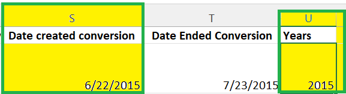
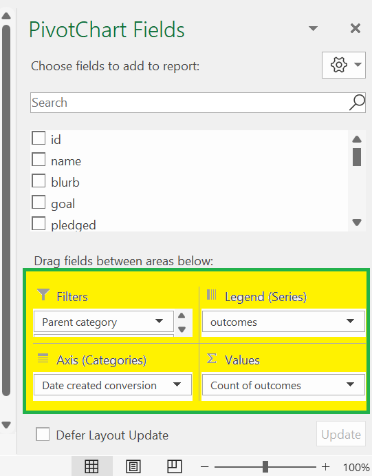
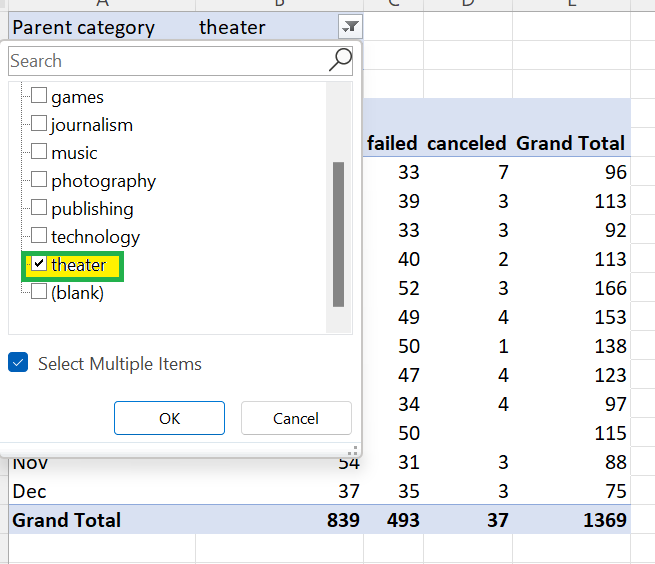
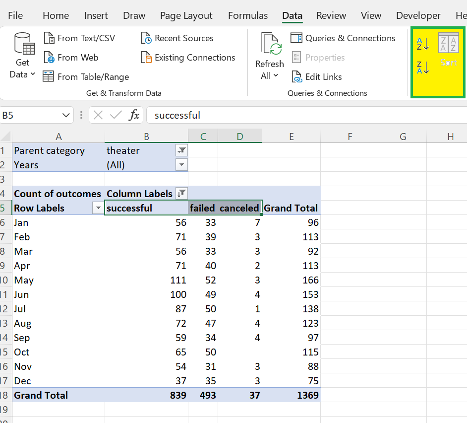
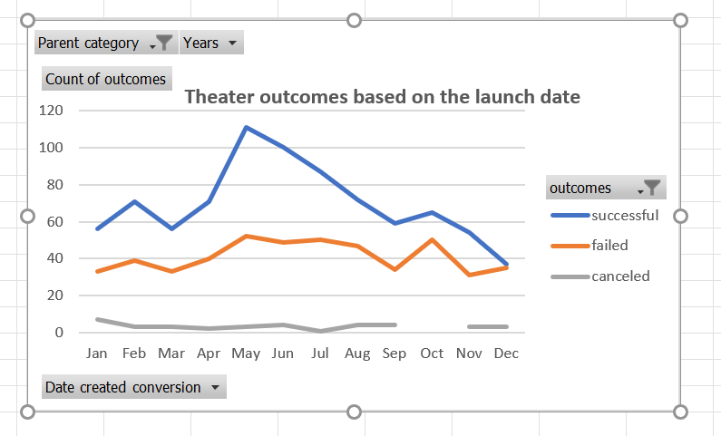
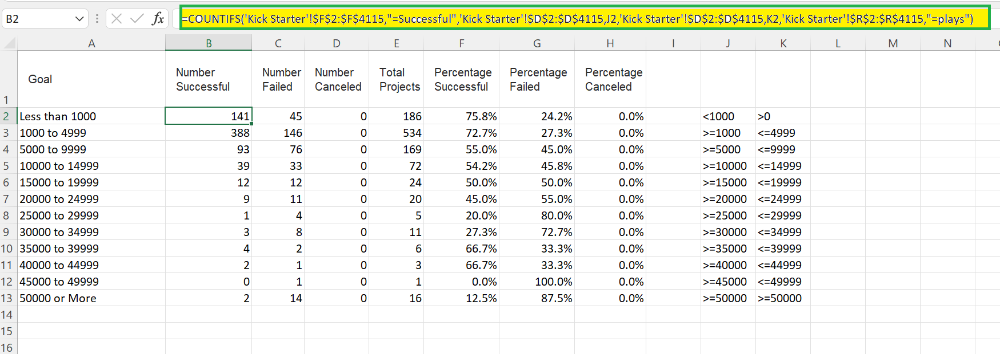
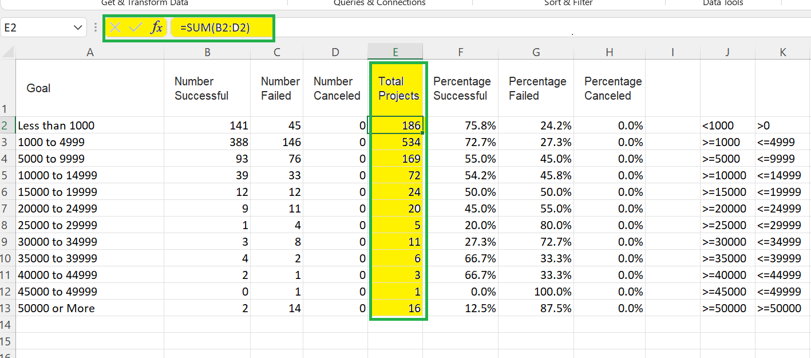
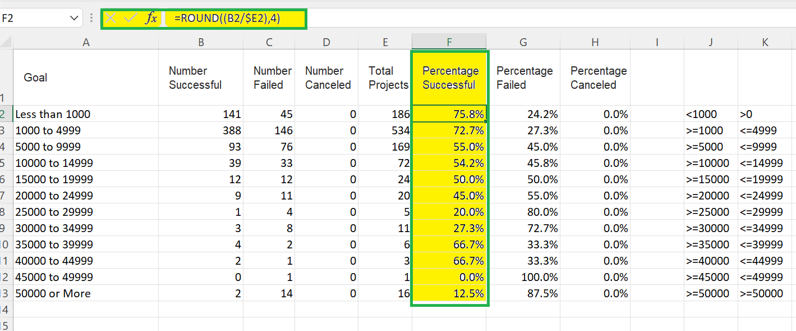
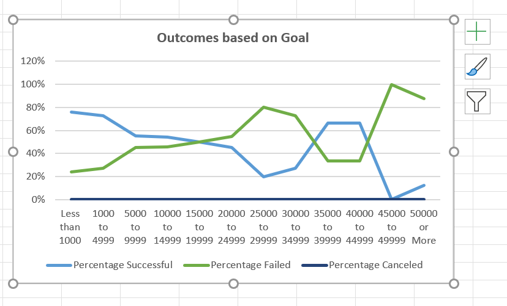

# Kickstarting with Excel

## Overview of Project
The main purpose of the project is to organize, sort and analyze the data, to uncover the hidden trends from raw data using Excel. These trends can be helpful to retrieve useful insights and will provide the greater understanding of the data.

### Purpose
In this project, we were working on a Crowdfunding data to determine the specific factors that contribute towards the success of a campaign.

## Analysis and Challenges

### Analysis of Outcomes Based on Launch Date
The main purpose of analyzing outcomes based on launch date was to find out the best time of the year to start a similar campaign, which has a greater success rate in comparison with other months. Based on the count of the successful outcomes, campaigns under **theater** parent category were found to be most successful.
Following steps were followed for the analysis of theater outcomes based on launch date:

**1.** A **Years** column was created based on the **Date Created Conversion** column in the Kickstarter spreadsheet.

 

Above formula was used to compute the **Years** column from the **Date Created Conversion** column in the Kickstarter spreadsheet.

In the above image, it can be seen that the **Date Created Conversion** column is of the form "mm/dd/yyyy". The years formula was used to extract the "yyyy" portion from the column.
We will later use this **years** column as a filter in our pivot table analysis.

**2.** Now the pivot table was created using the Kickstarter spreadsheet using the following parameters: 

- Filters: "Parent category" and "Years"
- Columns: "outcomes" ---
Since we wanted to analyse the different kind of outcomes, we used "outcomes" as "Columns"
- Rows: "Date created conversion" ---
Since data needs to be analysed for different dates, so we selected "Date created conversion" in Rows area.
After dragging the "Date created conversion" field in the Row area, two other fields get auto-populated namely
"Years2" and "Quarters" along with "Date created conversion" field. Excel automatically populates these fields,
from which we can can select the suitable field as per our requirements. In the current case, we chose
"Date created conversion" field so as to group the outcomes month-wise and removed the unwanted fields.
- Values: "Count of outcomes" ---
Since we wanted to analyse the total number of "successful", "failed" and "canceled" outcomes, that's
why we have used the count measure.

**3.** Now we filtered "theater" from the parent category list since campaigns under the "theater" parent category had the highest success rate based on the total number of outcomes.

**4.** Now the campaign outcomes were sorted in descending order using the sort option from data menu.

**5.** Now a line chart is created using the line chart option from insert menu to show the number of successful, failed, or canceled projects by month.

### Analysis of Outcomes Based on Goals
The main purpose of the analysis was to visualize the percentage of successful, failed, and canceled plays based on the funding goal amounts. This analysis can prove useful if we want to determine an optimum range of funding goal amount that should be targeted in a similar campaign. ---
Following steps were followed for the analysis of outcomes based on goals:

1. Firstly, the funding goal-amount ranges were created to group the projects based on their targeted goal amounts.

2. Now COUNTIFS() functions were used to populate "Number Successful", "Number Failed", and "Number Canceled" columns for "Plays" subcategory. The COUNTIFS function was applied in the following manner:
    - **criteria_range_1:** outcome column (F) range of Kickstarter spreadsheet was selected as criteria range_1 and,
    - **criteria_1:** the outcome was compared against "successful" to get the number of successful campaigns.

    - **criteria_range_2:** goal column (D) of Kickstarter spreadsheet was selected and,
    - **criteria_2:** the goal amount was compared against the range of Funding goal amount according to column A of "Outcomes based on Goals" spreadsheet.

    - **criteria_range_3:** subcategory column (R) of Kickstarter spreadsheet was selected and,
    - **criteria_3:** the subcategory was compared against "Plays" to filter the outcomes based on "Plays".

    

3. Now Sum() functions were used to populate the total number of projects under "Plays" subcategory that were one of "successful", "failed" or "canceled".

4. Now we easily calculated the percentage of "successful", "failed" or "canceled" projects by dividing the corresponding number by the total for each range of funding goal amounts. Values need to be round up by four decimal points, so the ROUND() function was applied to the division result. We also had to use percentage formatting for each of the newly calculated percentage columns.

5. Created a line chart titled "Outcomes Based on Goal" using line chart option from insert menu to visualize the relationship between the funding goal-amount ranges on the x-axis and the percentage of "successful", "failed", or "canceled" projects on the y-axis.

### Challenges and Difficulties Encountered

## Results

- What are two conclusions you can draw about the Outcomes based on Launch Date?

- What can you conclude about the Outcomes based on Goals?

- What are some limitations of this dataset?

- What are some other possible tables and/or graphs that we could create?
